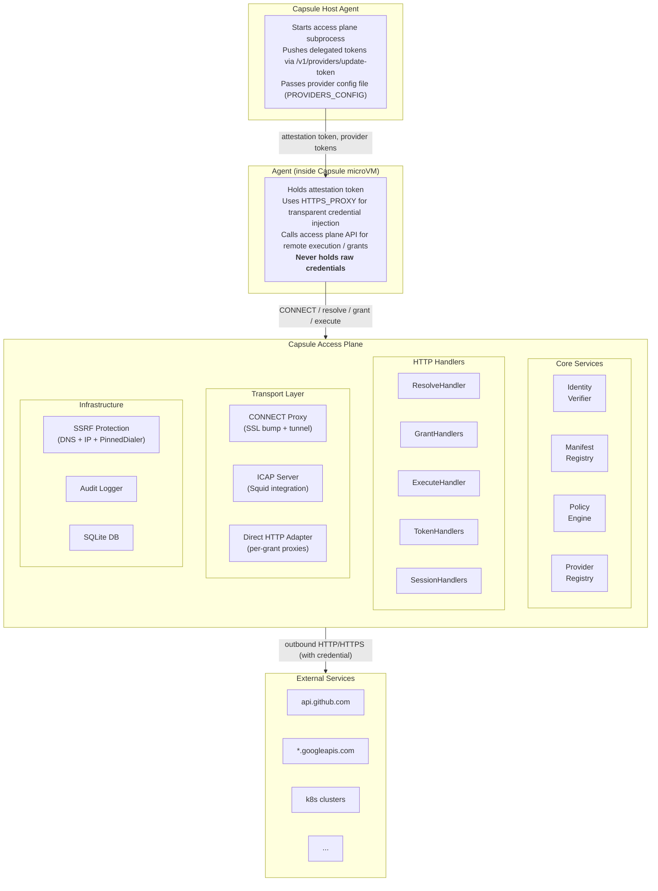
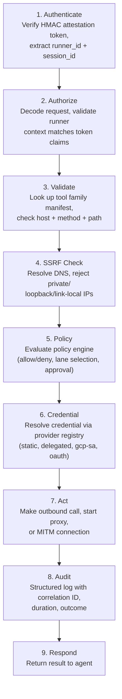
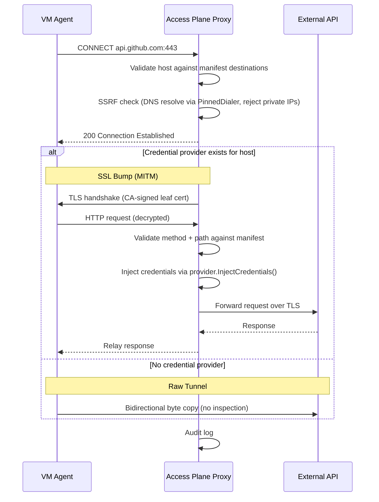
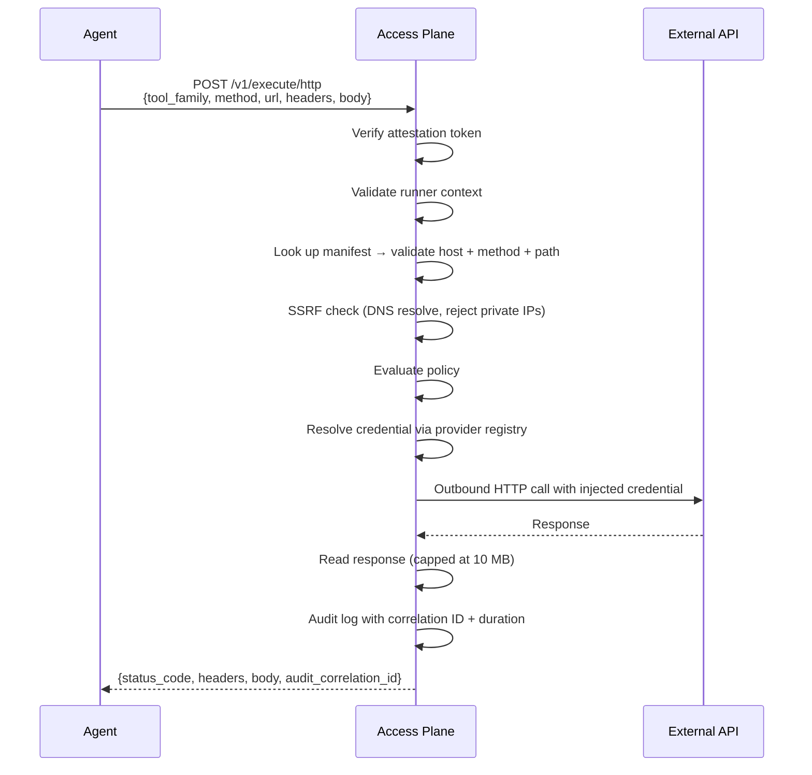
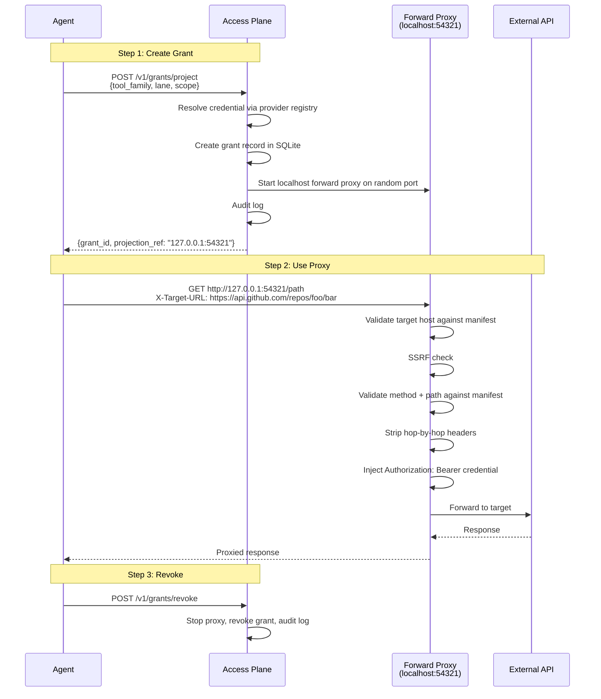
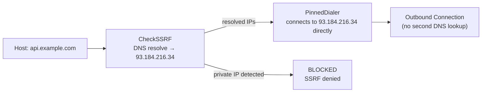
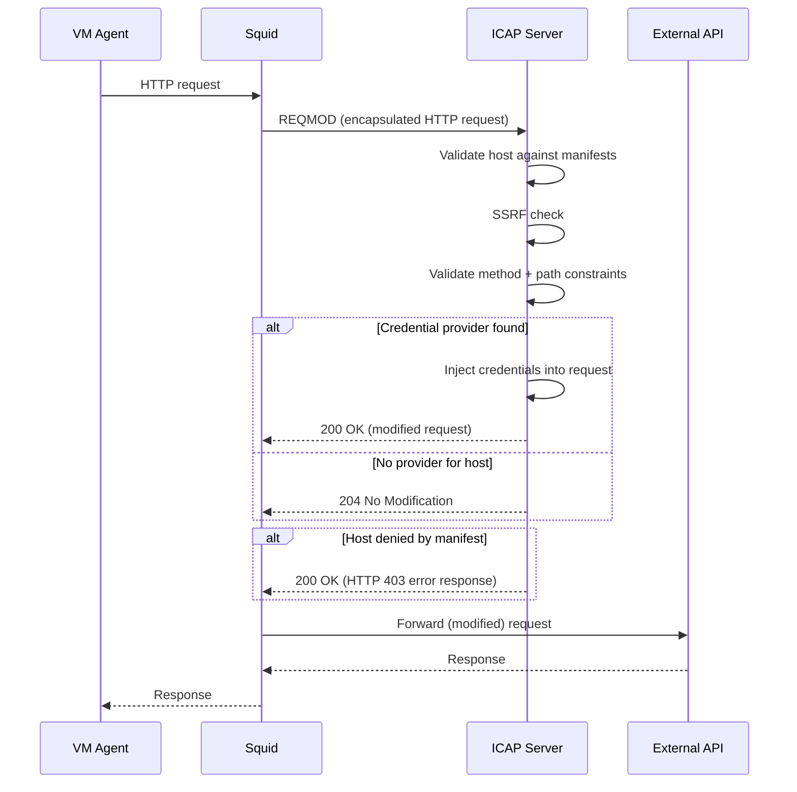

# Architecture

This document describes the design of the Capsule Access Plane: what problem it
solves, how the components fit together, and how a request flows through the
system.

## Problem Statement

AI agents running inside Capsule microVMs need to interact with external
authenticated services (GitHub, GCP, Kubernetes, internal APIs). The security
goal is:

1. Agents must never hold raw credentials
2. Every outbound call must be validated against a declared manifest
3. Every operation must be audit-logged with full context
4. Operators must be able to control what each tool family is allowed to do
5. DNS-based SSRF attacks must be blocked

## System Context

## Request Lifecycle

Every access-plane interaction follows the same pattern:

### CONNECT Proxy Flow (SSL Bump)

### Execute Flow (Remote Execution Lane)

### Grant + Proxy Flow (Direct HTTP Lane)

## Component Model

### Identity Verifier (`identity/`)

Validates HMAC-SHA256 signed attestation tokens. Tokens are issued by the
Capsule control plane and contain runner_id, session_id, workload_key, and
expiry. Tokens also carry optional identity fields:

- **IdentityMode** — `"user-direct"` (agent acts on behalf of a user) or
  `"virtual"` (agent has its own persistent identity)
- **UserEmail** — the human user's email (user-direct mode)
- **VirtualIdentityID** — the agent's own identity (virtual mode)

`Claims.EffectiveIdentity()` resolves the right identity string for audit
and policy purposes.

**Tenant scoping:** When `TENANT_ID` is set, the verifier validates that the
token's `tenant_id` claim matches. This ensures tokens issued for one tenant
cannot be used against another tenant's access plane in multi-tenant deployments.

**Minimum secret size:** The HMAC secret must be at least 32 bytes to prevent
brute-force attacks on short secrets.

Token format: `base64(json_payload).base64(hmac_signature)`

### Manifest Registry (`manifest/`)

Stores tool family manifests loaded from embedded YAML files at startup.
Manifests declare:

- **destinations** — allowed target hosts with optional CIDR allowlists
- **method_constraints** — allowed HTTP methods, path glob patterns, enforcement mode
- **supported_lanes** — which execution lanes this family supports
- **preferred_lane** — default lane selection by risk class
- **logical_actions** — named operations with risk classifications
- **provider** — named credential provider for this family

### SSRF Protection (`manifest/ssrf.go`, `manifest/dialer.go`)

Every outbound connection (execute handler, direct HTTP proxy, CONNECT proxy,
ICAP handler) passes through `CheckSSRF`:

1. If the host is an IP literal, validate directly (no DNS)
2. Otherwise, resolve via DNS
3. If `AllowedIPs` is set on the destination, resolved IPs must fall within those CIDRs
4. Otherwise, reject private IPs (RFC 1918, loopback, link-local including 169.254.169.254)

**DNS rebinding protection:** `CheckSSRF` returns the resolved IP addresses,
which are then passed to `PinnedDialer`. The `PinnedDialer` creates a
`DialContext` function that connects directly to the pre-resolved IPs instead
of performing DNS resolution again. This prevents TOCTOU (time-of-check-to-time-of-use)
attacks where a DNS response changes between the SSRF check and the actual
connection.

### Policy Engine (`policy/`)

Evaluates allow/deny decisions and selects execution lanes. The current
implementation (`ManifestBasedEngine`) uses manifests directly. The engine
is behind a `PolicyEngine` interface for future replacement (OPA, Cedar, etc.).

### Provider Registry (`providers/`)

Manages credential providers. Each provider implements `CredentialProvider`:

| Method | Purpose |
|--------|---------|
| `Name()` | Unique identifier |
| `Type()` | Provider type (static, delegated, etc.) |
| `Matches(host)` | Whether this provider handles a given host |
| `InjectCredentials(req)` | Modify HTTP request to include credential |
| `ResolveToken(ctx)` | Return raw token value |
| `Start(ctx)` / `Stop()` | Lifecycle management |

Built-in provider types:

- **static** — wraps `CredentialResolver` (env/literal/stored schemes)
- **delegated** — accepts externally-pushed tokens via `UpdateToken()`.
  Supports session-scoped tokens keyed by source IP, per-user identity headers
  (`X-Glean-User-Email`, custom headers), and multi-credential routing rules
  (different tokens for different HTTP methods/paths on the same domain).
- **gcp-sa** — mints short-lived GCP access tokens by impersonating a service
  account via the IAM Credentials API (`generateAccessToken`). Background
  refresh loop keeps the token fresh (refreshes at 75% of lifetime).
- **oauth-jwt-bearer** — exchanges a GCP identity token for an OAuth access
  token via a configured token endpoint. Used for third-party services that
  accept federated OAuth tokens.

The registry supports:
- Named lookup (`Get`, `ForManifest`) for manifest-driven credential selection
- Host-based lookup (`ForHost`) for CONNECT proxy credential injection
- Session-scoped resolution via source IP context for per-user isolation
- Default provider fallback for backward compatibility
- JSON config file loading (`PROVIDERS_CONFIG`)

### CONNECT Proxy (`proxy/`)

An HTTPS CONNECT proxy with selective SSL bump:

- **CA generation** — ECDSA P-256 self-signed CA created at startup
- **Dynamic leaf certs** — per-hostname cert cache with IP SAN support
- **Selective MITM** — only bump hosts with a credential provider; tunnel the rest
- **Credential injection** — `provider.InjectCredentials(req)` on every MITM'd request
- **Full validation** — host, SSRF, method+path enforcement on every connection
- **Audit logging** — every CONNECT logged with result and duration

### ICAP Server (`icap/`)

An ICAP/1.0 REQMOD server for integration with Squid (or any ICAP-capable proxy).
This is an alternative to the built-in CONNECT proxy for deployments that already
use Squid as their HTTP proxy.

The ICAP server handles:

- **OPTIONS** — advertises REQMOD capabilities
- **REQMOD** — intercepts HTTP requests: validates against manifests, performs
  SSRF checks, enforces method+path constraints, and injects credentials
- **Session context** — extracts session ID from `X-Proxy-Token` header for
  per-session credential scoping
- **Error responses** — returns encapsulated HTTP error responses (403, 405)
  when requests are denied

Enable with `ICAP_ADDR=:1344`. The ICAP server implements the `ProxyBackend`
interface alongside the CONNECT proxy.

### Grant Service (`grants/`)

Manages the grant lifecycle (project, exchange, refresh, revoke). Grants are
stored in SQLite with runner_id scoping.

### Direct HTTP Adapter (`runtime/direct_http.go`)

Manages per-grant forward proxies. Each proxy validates host, SSRF, method+path,
strips hop-by-hop headers, and injects credentials.

### Audit Logger (`audit/`)

All operations emit structured log records via `slog`. Each record includes
session, runner, turn, tool family, target, result, duration, and a correlation
ID.

## Security Model

| Layer | Mechanism |
|-------|-----------|
| Identity | HMAC-SHA256 attestation tokens with user-direct and virtual identity modes; minimum 32-byte secret |
| Tenant isolation | Optional `TENANT_ID` scoping — tokens must carry matching `tenant_id` claim |
| Authorization | Runner context must match token claims |
| Manifest validation | Destination host (with wildcard/glob matching) + HTTP method + URL path glob allowlist |
| SSRF protection | DNS resolution + private IP blocking + CIDR allowlists + PinnedDialer (DNS rebinding prevention) |
| Policy | Pluggable engine (currently manifest-based, CEL interface ready) |
| Credential isolation | Credentials resolved server-side via provider registry, per-session scoping |
| Multi-credential | Request-level credential selection (method+path rules) for same-domain dual-token scenarios |
| Proxy security | Hop-by-hop header stripping, selective SSL bump, identity header injection |
| ICAP integration | Squid-delegated request modification with full manifest validation |
| Audit | Every operation logged with full context + identity mode attribution |
| Grant scoping | Grants bound to runner_id, time-limited, revocable |
