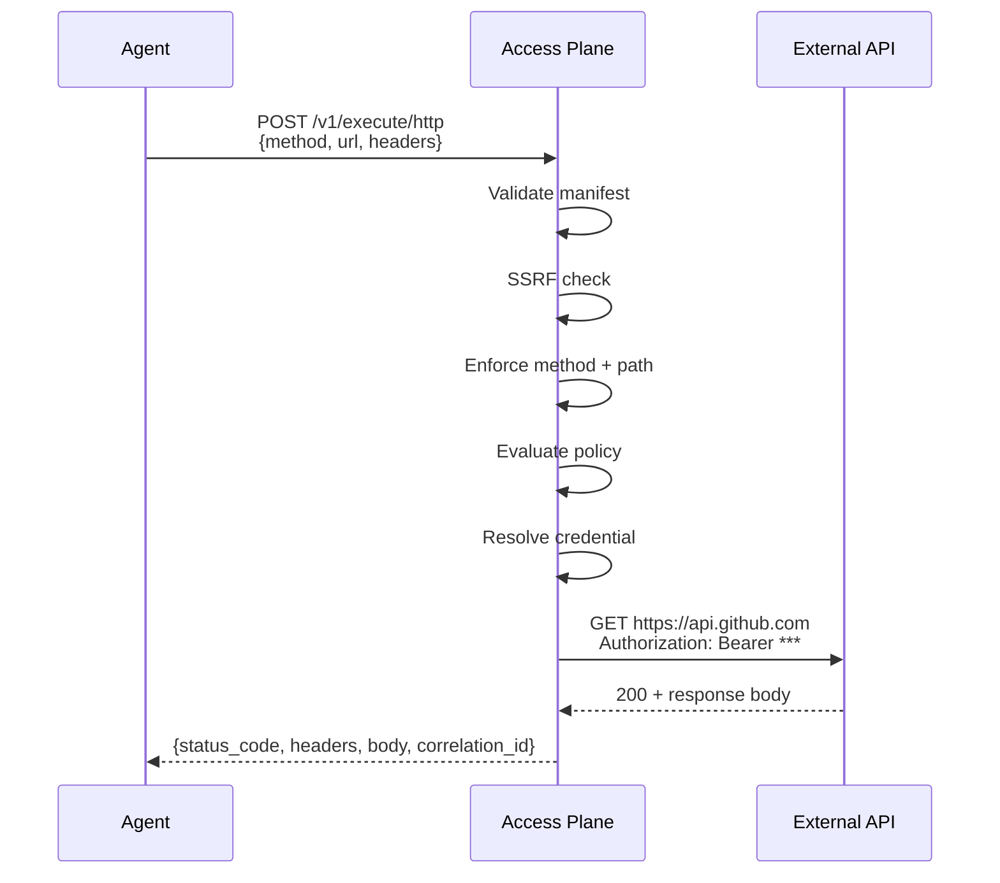
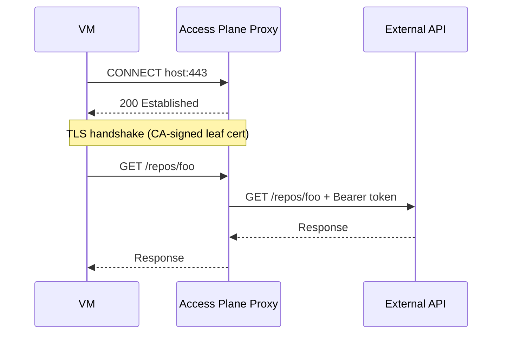
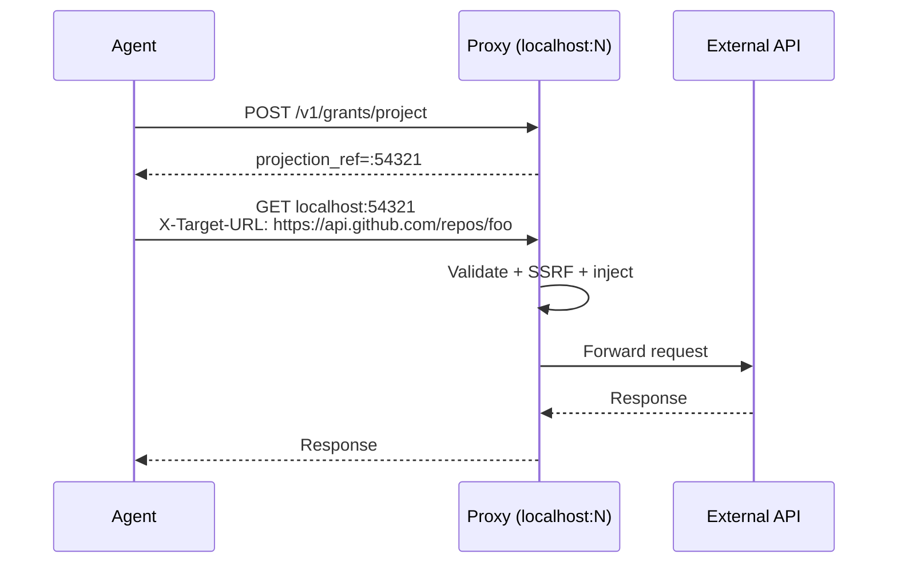
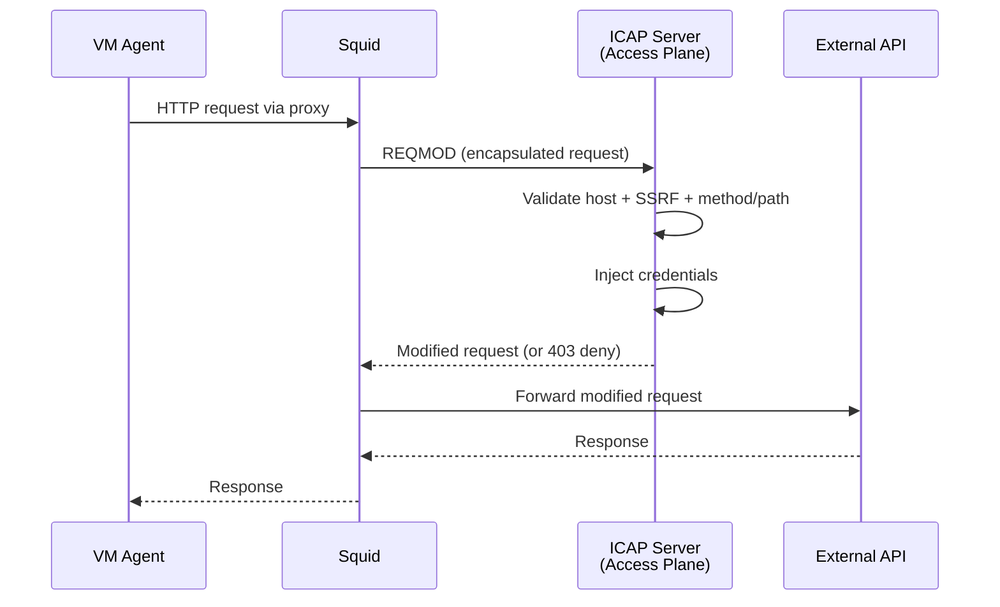
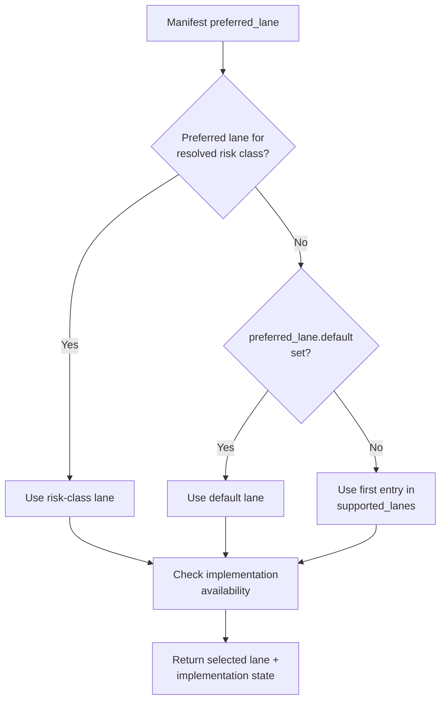

# Execution Lanes

The access plane routes every tool operation through an **execution lane** — the
mechanism by which the agent's intent is translated into an authenticated
outbound call. The lane determines where the credential lives, how much the
agent can see, and what level of control the access plane retains.

## Lane Comparison

| | Remote Execution (Lane 1) | Direct HTTP (Lane 2) | Helper Session (Lane 3) |
|---|---|---|---|
| Credential visible to agent? | No | No — injected on outbound leg only | In helper only |
| Agent makes own HTTP calls? | No | Yes (HTTPS_PROXY or grant proxy) | Yes (via CLI) |
| Streaming support | No (sync req/res) | Yes (full proxy) | Yes (native CLI) |
| SSRF protection | Yes | Yes | N/A |
| Path enforcement | Yes (glob) | Yes (glob) | N/A |
| Surface kind | http | http | cli |
| Audit granularity | Per-request | Per-request | Per-session |
| Proxy modes | N/A | CONNECT proxy, ICAP/Squid, grant proxy | N/A |
| Status | Implemented | Implemented | Not implemented |

## Lane 1: Remote Execution

**Endpoint:** `POST /v1/execute/http`

The agent sends the full HTTP request parameters (method, URL, headers, body)
to the access plane. The access plane validates everything, injects the
credential, makes the outbound call, and returns the complete response.



**When to use:** Default for HTTP-surface tools. Best credential isolation.
The agent never sees the token in any form.

**Limitations:** Synchronous only. Response body capped at 10 MB. No streaming.

## Lane 2: Direct HTTP

Two modes are available:

### CONNECT Proxy (SSL Bump)

The VM sets `HTTPS_PROXY` and makes standard HTTPS calls. The access plane
proxy intercepts CONNECT requests and selectively MITM's them.



**Selective bump:** Only hosts with a credential provider are MITM'd. Other
allowed hosts are raw-tunneled (no inspection, no credential injection).
Hosts not in any manifest are rejected with 403.

**When to use:** When the agent should use standard HTTP clients/libraries
with no code changes. Best for transparent credential injection at scale.

### Grant-Based Forward Proxy

The agent requests a grant, receives a local proxy address, and sends requests
with `X-Target-URL` headers.



**When to use:** When the agent needs explicit grant lifecycle control
(project, exchange, refresh, revoke) or when the CONNECT proxy is not available.

### ICAP/Squid Integration

For deployments that already use Squid as their HTTP proxy, the access plane
provides an ICAP REQMOD server that integrates with Squid's request adaptation
framework. Squid forwards HTTP requests to the ICAP server, which validates
them against manifests and injects credentials before Squid forwards the
request to the target.



**When to use:** When Squid is already deployed as the network proxy and you
want to avoid running a separate CONNECT proxy. Configured via `ICAP_ADDR`
environment variable.

## Lane 3: Helper Session (not yet implemented)

For CLI tools that use credential helper protocols — `git credential fill`,
kubectl exec-credential plugins, `gcloud auth print-access-token`, etc.

**Families that need this:** `github_git`, `kubectl`, `gcp_cli_read`, `gcp_adc`.

## Lane Selection

The policy engine selects the lane for each request based on:

1. **Manifest preferred_lane** — per risk-class or default preference
2. **Supported lanes** — what the tool family supports
3. **Implementation availability** — whether the lane is actually built

The selection happens during `/v1/resolve`. The agent then uses the appropriate
endpoint for the selected lane.



Example manifest:

```yaml
preferred_lane:
  default: direct_http        # standard risk uses proxy
  elevated: remote_execution  # elevated risk uses broker
```
