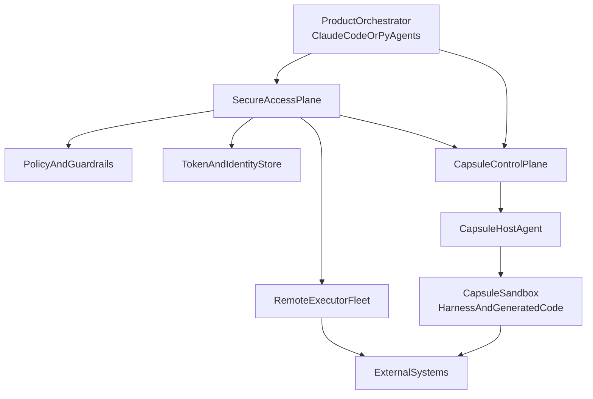
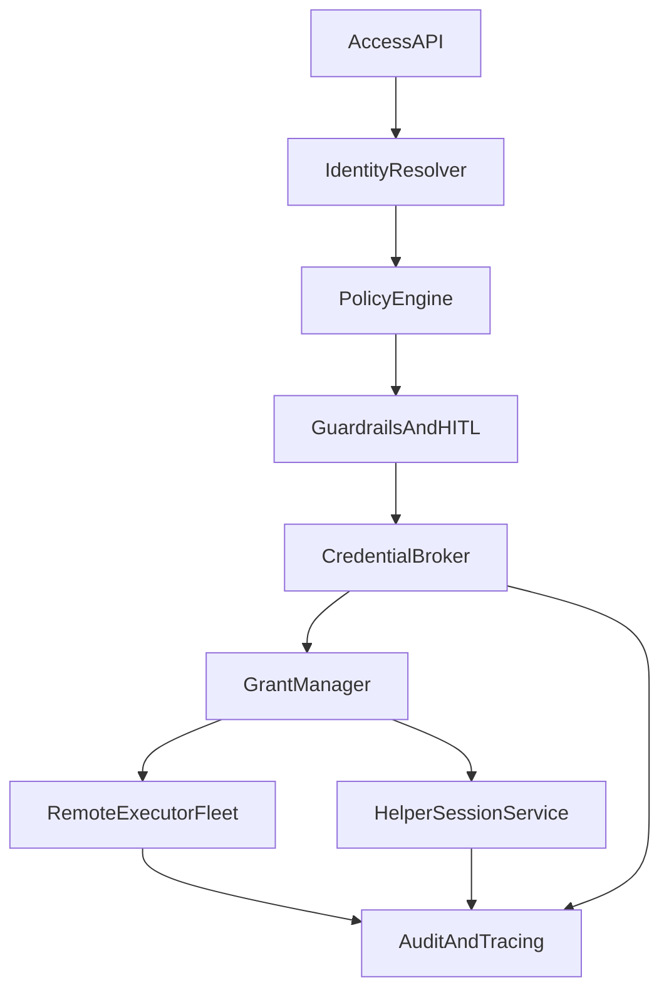
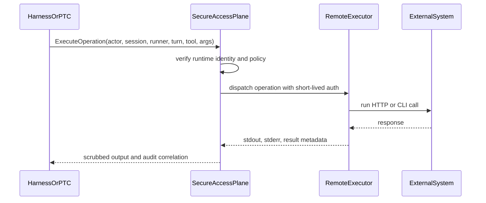
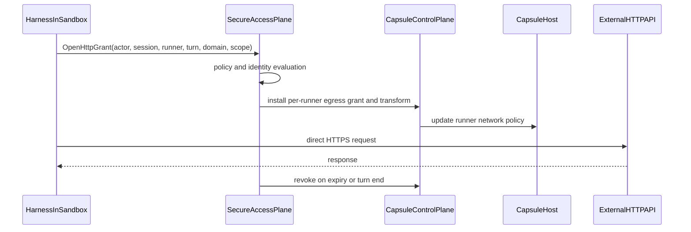
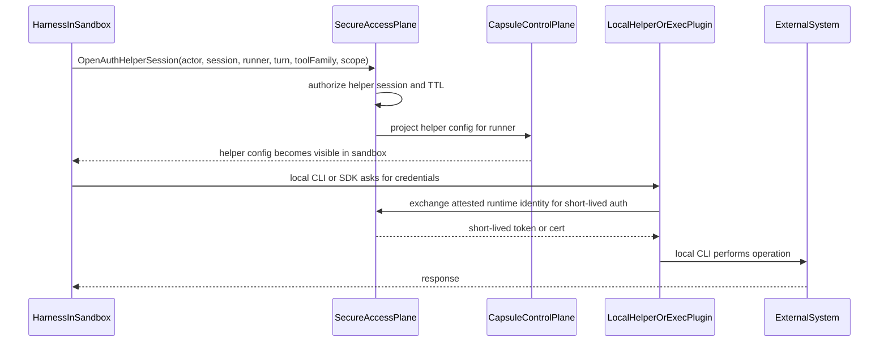

# Capsule Secure Access Plane

This document describes a secure access plane for Capsule that supports:

- harnesses running inside a sandbox
- harnesses running outside a sandbox while sending untrusted code into it
- long-lived sessions that need repeat access to tools and external systems
- both HTTP APIs and CLI-heavy workflows

The short version is:

- long-lived credentials stay outside Capsule sandboxes
- a separate secure access plane is the semantic authority for identity, policy, credentials, and audit
- the access plane supports three delivery lanes:
  - remote broker execution
  - direct HTTP grants
  - local auth helper sessions for supported CLI and SDK families
- Capsule remains the sandbox and session substrate, not the credential authority

## Status

This is a design proposal, not an implementation commit. It is intended to guide
future architecture and scoping.

## Problem Statement

Capsule is becoming a substrate for long-lived agent sessions rather than just
short-lived sandbox bringup. Those sessions need access to:

- external APIs
- internal debug endpoints
- provider CLIs like `gcloud`, `kubectl`, and `gh`
- future tool families that may be HTTP, RPC, CLI, or provider SDK based

The hard part is that these use cases span two execution topologies:

1. the harness runs inside the sandbox and needs local execution fidelity
2. the harness runs outside the sandbox and treats the sandbox as pure compute

The security challenge is the same in both modes:

- the LLM and generated code are not a trust boundary
- prompt injection must be assumed possible
- sandboxes may execute arbitrary code and binaries
- long-lived user and service credentials must not become ambient inside the sandbox

HTTP-only solutions like egress allowlists plus header transforms are useful,
but they do not fully cover CLI and SDK-heavy workloads. CLI tools often obtain
credentials through:

- env vars
- well-known credential files
- provider metadata flows
- exec plugins
- credential helpers
- token caches
- subprocesses and SDK-specific resolution chains

For CLI-majority systems, a pure network-proxy model is not sufficient.

## Goals

- keep long-lived credentials and refresh tokens out of sandboxes and model context
- support both harness-in-sandbox and harness-outside-sandbox modes
- make HTTP and CLI access auditable and attributable to the true user and agent
- support long-lived Capsule sessions with short-lived, revocable access grants
- keep Capsule runtime logic generic and reusable across runtimes
- avoid baking provider-specific credential logic into the Capsule runtime

## Non-Goals

- solve every provider auth flow with one universal mechanism
- allow arbitrary local credentialed CLI execution inside a sandbox with no risk tradeoff
- turn Capsule into the system of record for user token storage
- treat prompts or LLM behavior as a security boundary

## Design Principles

1. **Sandbox is compute, not authority.**
   A sandbox has a workload identity. It should not be the place where durable
   authority lives.

2. **One semantic authority, multiple delivery lanes.**
   The secure access plane decides identity, policy, scope, and audit. It can
   then choose how access is delivered.

3. **Broker execution is the default lane.**
   This is the safest general answer for CLI-heavy workloads.

4. **Direct in-sandbox access is an explicit policy decision.**
   It exists to preserve runtime fidelity, not as the ambient default.

5. **Sessions can be long-lived; grants should not be.**
   Long-lived Capsule sessions are compatible with short-lived access grants.

6. **Provider-specific auth belongs outside Capsule core.**
   Capsule should integrate with the access plane, not reimplement cloud and SaaS
   auth patterns in the runner or guest agent.

## Trust Model

There are four distinct trust layers:

### 1. Control Plane and Access Plane

Highly trusted.

- Capsule control plane
- host agents
- secure access plane
- token and identity stores
- policy, guardrails, and approval systems

This domain may hold decrypted short-lived credentials in memory and can resolve
or mint access on behalf of a user and agent.

### 2. Harness

Trust depends on placement.

- outside sandbox: part of the trusted control domain
- inside sandbox: more trusted than arbitrary generated code, but not equivalent
  to the control plane unless additional isolation exists

This distinction matters. If the harness and generated code share the same user,
filesystem, localhost surfaces, and helper sockets, then generated code can often
use whatever the harness can use.

### 3. Generated Code and Model-Directed Execution

Untrusted.

- prompt injection must be assumed possible
- code may read files, spawn subprocesses, and attempt exfiltration
- code may try to abuse helper surfaces, caches, or policy gaps

### 4. External Systems

Trusted by policy, but outside Capsule control.

- GCP
- GitHub
- JIRA
- Salesforce
- internal debug systems
- future SaaS or cloud endpoints

These systems should see the correct effective principal and produce auditable
records attributable to the user and agent where possible.

## Terminology

- `session_id`: Capsule session identity for runner attach, pause/resume, and fork lineage
- `runner_id`: live runtime instance currently attached to a session
- `turn_id`: unit of work associated with an ingress into a session
- `actor_context`: user identity, optional virtual identity, agent identity, and turn metadata
- `grant`: short-lived permission to access a specific tool family, destination, or scope
- `helper session`: short-lived local auth surface for a supported CLI or SDK family

## High-Level Architecture



This diagram intentionally shows two possible physical egress origins:

- `execFleet -> ExternalSystems` for remote broker execution
- `sandbox -> ExternalSystems` for direct HTTP grants or helper-backed local execution

The access plane remains the semantic authority in both cases.

## Why the Broker Is Also an Executor

For HTTP-only systems, a network-layer proxy or header transform can sometimes be
enough. That is not true for CLI-majority workloads.

CLI tools usually do not authenticate at a single neat network boundary. Instead
they depend on provider-specific resolution paths such as:

- Google ADC and workload identity federation config
- Kubernetes exec credential plugins
- AWS `credential_process`
- Git credential helpers
- local token caches and config directories
- metadata and subprocess-based exchange flows

Because of this, a secure access plane for Capsule needs to act as:

- credential authority
- policy and scope authority
- audit authority
- **remote executor by default**

If it only acts as a proxy, it cannot uniformly handle:

- CLIs
- provider SDKs
- metadata-based auth
- non-HTTP tools
- rich user and virtual identity attribution

This does **not** mean all privileged work must happen remotely forever. It means
remote execution is the safest and most general default lane.

## Access Lanes

Capsule secure access should support four distinct execution lanes.

### Lane 0: Local Uncredentialed Compute

No access-plane involvement.

Examples:

- `pytest`
- `ripgrep`
- `git diff`
- compiling and running local code that does not require privileged external auth

This is the baseline sandbox capability and preserves the value of in-sandbox
computation.

### Lane 1: Remote Broker Execution

The access plane runs the HTTP call, CLI, or custom action on trusted compute
and streams back the result.

Examples:

- `kubectl get pods`
- `gcloud logging read`
- `gh api ...`
- internal debug or admin tools
- broker-hosted HTTP tools

This is the default lane for credentialed CLI work.

### Lane 2: Direct HTTP Grants

The access plane authorizes direct HTTP egress from a specific runner and tells
Capsule to install temporary network rules and header or proxy transforms.

Examples:

- calling a provider REST API from code inside the sandbox
- allowing direct calls to GitHub, Stripe, or an internal HTTP endpoint for a
  bounded turn

This lane preserves in-sandbox HTTP fidelity and is a natural place to use
Vercel-style patterns.

### Lane 3: Local Auth Helper Sessions

The access plane authorizes a supported local auth surface for a bounded tool
family. The sandbox runs the real CLI locally, but the credentials are delivered
through provider-native helper patterns instead of durable secrets.

Examples:

- `kubectl` using an exec credential plugin
- Google SDKs using workload identity federation or executable-sourced ADC
- AWS CLI using `credential_process`
- Git or GitHub tooling using a credential helper

This lane should be used selectively for supported tool families where local
execution fidelity matters.

## Lane Comparison

| Lane | Where execution happens | Best for | Supports CLI well | Sandbox sees reusable auth | Audit simplicity | Implementation complexity |
| --- | --- | --- | --- | --- | --- | --- |
| 0. Local uncredentialed compute | Sandbox | local compute only | n/a | no | high | low |
| 1. Remote broker execution | Trusted executor fleet | most credentialed tools, especially CLIs | yes | no | highest | medium |
| 2. Direct HTTP grants | Sandbox | HTTP APIs needing local fidelity | HTTP only | usually no durable auth | medium | medium |
| 3. Local auth helper session | Sandbox | selected CLI or SDK families | yes, selectively | some short-lived usable authority | medium | highest |

## Recommended Default Policy

- Lane 0 is always available for ordinary local compute
- Lane 1 is the default for privileged HTTP and CLI execution
- Lane 2 is opt-in for allowlisted HTTP destinations where local fidelity matters
- Lane 3 is opt-in for supported CLI and SDK families where local execution is
  necessary and the risk is justified

## Secure Access Plane Components



### Access API

The front door used by trusted orchestrators, in-sandbox harnesses, or local
helper surfaces.

Core methods:

- `ExecuteOperation`
- `OpenHttpGrant`
- `OpenAuthHelperSession`
- `RevokeGrant`
- `DescribeGrantState`

### Identity Resolver

Resolves:

- user identity
- virtual identity
- agent identity
- datasource principal mapping
- runtime identity of the requesting runner

### Policy Engine

Computes effective authority as the intersection of:

- user-native provider scopes or roles
- virtual identity allowlists
- per-agent capability policy
- per-tool and per-datasource restrictions

### Guardrails and HITL

Applies:

- read-only and write policies
- environment restrictions
- debug or production write approvals
- user confirmation or administrator review where required

### Credential Broker

Responsible for:

- fetching or refreshing tokens from the existing token store
- minting short-lived credentials where supported
- selecting the correct delivery lane
- ensuring durable credentials remain out of the sandbox

### Grant Manager

Maintains short-lived grants bound to:

- user and virtual identity
- `session_id`
- `runner_id`
- `turn_id`
- target system
- capability scope
- TTL

### Remote Executor Fleet

Trusted compute that runs:

- broker-hosted HTTP calls
- provider CLIs
- internal admin and debug tools

### Helper Session Service

Issues and tracks local helper sessions for supported tool families.

Examples:

- generated kubeconfigs with exec plugins
- ADC or WIF config files
- AWS shared config with `credential_process`
- Git credential helper wiring

### Audit and Tracing

Records:

- actor user and virtual identity
- agent identity
- `session_id`, `runner_id`, and `turn_id`
- target system
- command, endpoint, or logical action
- result, duration, and policy decision

## Capsule Integration Points

Capsule should integrate with the access plane at a small number of explicit
boundaries.

### 1. Workload Identity and Attestation

Each runner should be able to present a verifiable identity to the access plane.

At minimum:

- `runner_id`
- `session_id`
- `workload_key`
- `host_id`
- issuance time
- expiration
- control-plane or host signature

This can be implemented as:

- signed JWT
- mTLS client identity
- SPIFFE-like workload identity
- another attested runtime identity format

### 2. Session and Turn Context Propagation

Access-plane calls should carry:

- `session_id`
- `runner_id`
- `turn_id`
- agent identity
- actor context from the product layer

This is required for correct audit and revocation.

### 3. Dynamic Network Policy Updates

Lane 2 depends on Capsule being able to install and revoke per-runner network
policy state.

Needed operations:

- allow destination domain or CIDR for runner X
- install header or proxy transform for runner X
- revoke grant for runner X
- apply TTL and explicit turn association

### 4. Helper Bootstrap Projection

Lane 3 depends on Capsule being able to project non-secret helper configuration
into the sandbox at runtime.

Examples:

- `KUBECONFIG=/tmp/capsule/kubeconfig`
- `GOOGLE_APPLICATION_CREDENTIALS=/tmp/capsule/gcp-wif.json`
- `AWS_CONFIG_FILE=/tmp/capsule/aws-config`
- `GIT_ASKPASS=/usr/local/bin/capsule-askpass`

These files should generally contain references to helpers or executable
credential sources, not durable secrets.

### 5. Lifecycle and Revocation Hooks

Capsule should notify or expose state for:

- runner allocation
- session pause
- session resume
- session fork
- runner release
- host draining

Grants should expire when their associated runtime context disappears or changes.

### 6. Audit Correlation

Capsule should propagate session and runner metadata so access-plane audit events
can be correlated back to a specific Capsule session and turn.

## Detailed Lane Designs

## Lane 1: Remote Broker Execution

This is the default for credentialed CLI and high-risk access.



### Strengths

- strongest protection against credential exfiltration
- works across HTTP, CLI, and custom tool families
- simplest place to apply approvals and policy
- easiest audit model
- easiest place to enforce actor and virtual identity attribution

### Weaknesses

- less local execution fidelity
- some commands that depend on sandbox-local files or processes need adaptation
- interactive CLI flows need streaming and cancellation support

### Use by Default For

- provider CLIs
- internal admin or debug tools
- write operations
- production-impacting calls
- new tool families before a local helper mode exists

### Required Features

- streaming stdout and stderr
- structured exit status
- cancellation
- max runtime and size limits
- stable command serialization and quoting rules

## Lane 2: Direct HTTP Grants

This lane preserves in-sandbox HTTP fidelity while keeping durable credentials
out of the guest.



### Strengths

- preserves direct HTTP behavior inside the sandbox
- keeps durable credentials outside the guest
- good fit for simple REST and GraphQL APIs
- useful for generated code that truly needs to make the request itself

### Weaknesses

- HTTP-centric
- weaker semantic visibility than remote execution
- not a full answer for CLI and SDK-heavy access
- domain allowlisting and transform behavior must be exact

### Use For

- allowlisted HTTP destinations
- code paths where direct in-process HTTP matters
- bounded read-only operations, then selected writes as policy matures

### Not a Good Fit For

- arbitrary CLIs
- provider SDKs that do local credential discovery
- metadata or plugin-driven auth flows

## Lane 3: Local Auth Helper Sessions

This lane exists for supported CLI and SDK families where local execution is
important enough to justify the added complexity.



### Supported Patterns

- Kubernetes exec credential plugins
- Google executable-sourced ADC or workload identity federation config
- AWS `credential_process`
- Git or GitHub credential helpers

### Strengths

- preserves local CLI or SDK behavior
- better fit for commands that depend on local workspace state
- supports provider-native auth flows where a network transform is not enough

### Weaknesses

- highest implementation complexity
- introduces short-lived usable authority into the sandbox boundary
- requires provider-specific support
- may require stronger isolation between harness and arbitrary generated code

### Use For

- selected tool families only
- cases where remote execution materially harms correctness or developer workflow
- short-lived, bounded sessions with narrow capability scopes

### Do Not Use As the Ambient Default

If arbitrary generated code can invoke the same helper surface as the harness,
then the sandbox effectively has access authority for the helper lifetime. This
lane must be policy-gated and tightly scoped.

## Tool Family Guidance

| Tool family | Preferred lane | Notes |
| --- | --- | --- |
| Local build and test tools | Lane 0 | No privileged auth required |
| REST or GraphQL API calls | Lane 1 or 2 | Lane 2 only when direct in-sandbox HTTP matters |
| `kubectl` | Lane 1 by default, Lane 3 selectively | Exec plugin model makes Lane 3 feasible |
| `gcloud` and Google SDKs | Lane 1 by default, Lane 3 selectively | WIF and executable ADC can back Lane 3 |
| AWS CLI and SDKs | Lane 1 by default, Lane 3 selectively | `credential_process` is the local helper pattern |
| `gh` and GitHub API tooling | Lane 1 by default | Helper support is possible but often unnecessary |
| Internal debug CLIs | Lane 1 | Strongest audit and policy placement |
| Arbitrary generated code using cloud SDKs | Lane 1 by default, Lane 2 or 3 only by explicit exception | Highest risk area |

## Harness Placement Guidance

| Harness placement | Recommended default for privileged access | Why |
| --- | --- | --- |
| Harness outside sandbox | Lane 1 | Harness is already in the trusted control domain |
| Harness inside sandbox, no sub-isolation | Lane 1 for almost all privileged work | Generated code can usually reach the same local surfaces |
| Harness inside sandbox with strong local isolation | Lane 1 default, Lane 2 and 3 allowed selectively | Better protection for helper sockets, files, and plugins |

## Claude Code Example in a Long-Lived Capsule Session

Assume:

- Claude Code runs inside a long-lived Capsule session
- the session may survive for hours or days
- the sandbox hosts both the harness and generated code
- the user wants both ordinary shell execution and access to cloud or SaaS tools

### Case A: Ordinary local shell execution

Claude Code runs:

- `pytest`
- `npm test`
- `git diff`
- `python my_script.py`

These use Lane 0. Capsule handles them natively inside the sandbox.

### Case B: Privileged CLI where local fidelity is not required

Claude Code wants:

- `kubectl get pods -n prod`
- `gcloud logging read ...`
- `gh api /repos/...`

Claude Code invokes a broker-backed wrapper such as:

```text
capsule-access execute-cli --tool kubectl --args '["get","pods","-n","prod"]'
```

The access plane runs the command remotely, streams stdout and stderr back into
the Claude Code session, and logs the action with user, agent, session, runner,
and turn context.

### Case C: Local CLI fidelity is required

Claude Code needs to run a local workflow that shells out to `kubectl` using
workspace-local generated manifests or test state.

It opens a helper session:

```text
capsule-access open-auth-session --tool-family kubectl --scope read-only --ttl 10m
```

The access plane authorizes the grant, Capsule projects a kubeconfig that points
to an exec credential plugin, and then local `kubectl` runs inside the sandbox.

The key policy rule is:

- the Capsule session is long-lived
- the helper grant is short-lived

If the session pauses, resumes, forks, or the turn ends, the helper grant should
be revoked or forced to reauthorize.

## Long-Lived Sessions, Short-Lived Grants

Long-lived sessions are desirable for developer and agent workflows:

- preserved workspace
- preserved processes
- preserved shell history and local state
- preserved conversational context

Access grants should remain short-lived:

- bound to `session_id`
- bound to `runner_id`
- ideally bound to `turn_id`
- revoked on pause, resume, or host migration unless explicitly renewed

This prevents privilege from becoming ambient just because the session itself is
long-lived.

## Tradeoffs

## If the Broker Is Also an Executor

### Benefits

- unified policy and audit surface
- strongest default security for CLI-heavy workloads
- minimal provider-specific auth logic inside Capsule
- easiest path to support new tool families safely

### Costs

- some local execution fidelity is lost unless Lane 2 or 3 is used
- developers may need wrapper commands or tool shims
- remote execution infrastructure must support streaming, cancellation, and scale

## If Direct Local Credential Use Is Allowed Too Broadly

### Benefits

- highest local fidelity
- fewer wrapper abstractions

### Costs

- higher risk of credential misuse or exfiltration
- harder audit and attribution boundaries
- much greater provider-specific complexity
- more incentive to build auth logic into the runtime itself

## Why a Pure Proxy Is Not Enough

HTTP transforms are elegant for a subset of access, but they do not solve:

- arbitrary CLI authentication
- provider SDK local auth chains
- metadata and helper-based flows
- non-HTTP tools
- user and virtual identity-aware policy by themselves

That is why the access plane must be more than a network proxy. It needs to be a
broker, a policy engine, and an executor.

## Recommended Rollout

### Phase 1: Remote Broker Execution First

Build:

- access-plane front door
- policy and identity resolution
- remote executor fleet
- audit pipeline
- Capsule attestation integration

Support:

- `ExecuteOperation`
- `ExecuteHttp`
- `ExecuteCli`

This covers the broadest surface safely, especially for CLIs.

### Phase 2: Direct HTTP Grants

Add:

- dynamic per-runner egress grants
- domain allowlists
- header or proxy transforms
- grant revocation tied to turn and session lifecycle

Use this for HTTP-heavy in-sandbox fidelity.

### Phase 3: Supported Local Auth Helpers

Add helper support for a small number of high-value families:

- `kubectl`
- Google ADC or WIF-backed tools
- AWS `credential_process`
- selected Git credential helpers

Do not start with "arbitrary CLI helper support". Start with explicit provider
families and clear revocation semantics.

### Phase 4: Stronger In-Sandbox Isolation for Harness Mode

If harness-in-sandbox is a strategic direction, invest in stronger local
separation between:

- harness process
- generated code
- helper sockets and config

Examples:

- separate users
- restricted filesystem permissions
- locked-down localhost or Unix socket access
- no ptrace
- protected helper directories

Without this, Lane 3 remains higher risk because generated code may use the same
helper surfaces as the harness.

## Open Questions

1. What attestation format should Capsule runners present to the access plane?
2. Should `turn_id` become a first-class concept before grants are implemented?
3. Which tool families are worth supporting in Lane 3 first?
4. How much local harness isolation inside the sandbox is practical?
5. Should direct HTTP grants be attached to runners, sessions, or turns?
6. How should grants behave across session fork and resume onto a new runner?

## Recommended Decisions

1. Externalize the secure access plane from Capsule.
2. Make broker execution the default lane for privileged access.
3. Keep Capsule responsible for attestation, network policy hooks, helper
   bootstrap, and lifecycle correlation.
4. Treat direct HTTP grants and local auth helper sessions as explicit,
   short-lived, policy-gated exceptions.
5. Optimize first for CLI-heavy reality, not for the HTTP-only happy path.

## Industry Signals

This proposal is aligned with the common pattern visible across recent public
systems:

- Vercel demonstrates the value of direct HTTP grants and boundary-layer header
  injection for sandboxed HTTP access.
- Anthropic and Cloudflare demonstrate the value of keeping semantic tool access
  outside untrusted agent code through trusted gateways or dispatch layers.
- cloud-native workload identity systems demonstrate the value of short-lived,
  attested credentials over static secrets.
- CI and runner systems demonstrate that untrusted code execution and durable
  credentials should be separated by design.

The secure access plane for Capsule should adopt those lessons without forcing a
single transport or delivery model onto every tool family.
